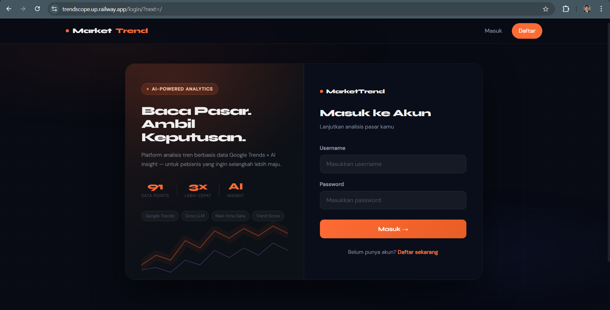
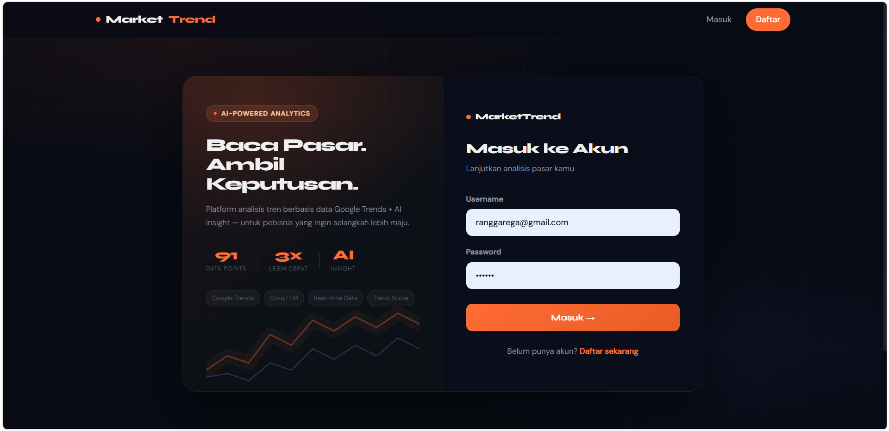
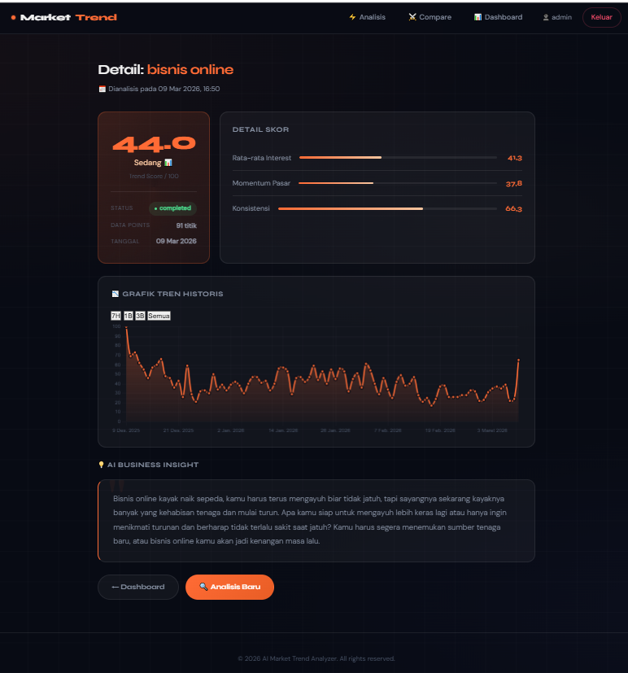
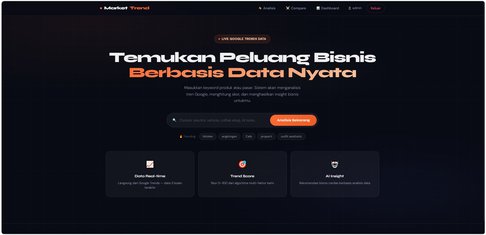
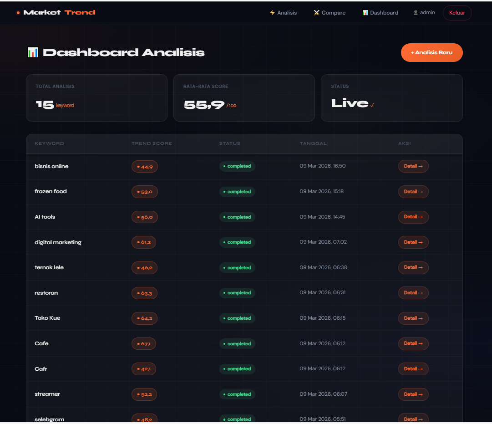
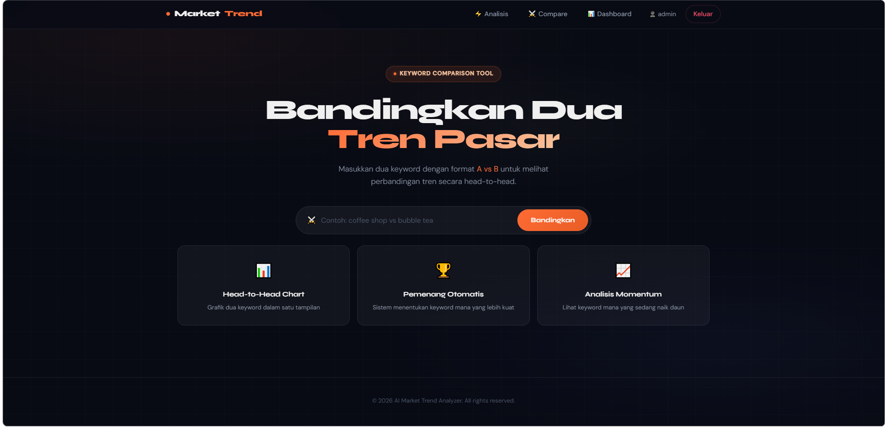
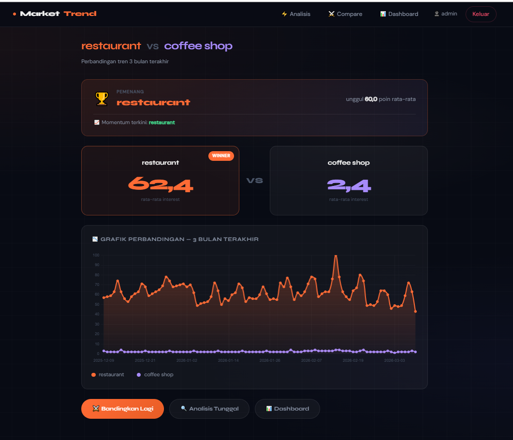

# AI Market Trend Analyzer

> An AI-powered market trend analysis platform built with Django, Google Trends, and Groq LLM — helping businesses discover opportunities through real data.


---

## Live Demo
# https://trendscope.up.railway.app
---

## Features

- **Real-time Google Trends Analysis** — Fetch live trend data from the past 3 months
- **Multi-factor Trend Scoring** — Score 0–100 based on average interest, momentum, and consistency
- **AI Business Insights** — Automated business recommendations powered by Groq LLM (llama-3.3-70b)
- **Keyword Comparison** — Head-to-head comparison of two keywords with interactive charts
- **Timeframe Selector** — Filter chart data by 7 days, 1 month, 3 months, or all time
- **User Authentication** — Register, login, and personal analysis dashboard per user
- **Dynamic Trending Chips** — Homepage trending keywords updated from real usage data

---

## Tech Stack

| Layer | Technology |
|---|---|
| Backend | Django 6, Python 3.12 |
| Database | PostgreSQL 18 |
| AI / LLM | Groq API (llama-3.3-70b-versatile) |
| Trends Data | pytrends (Google Trends API) |
| Frontend | Chart.js, Vanilla JS |
| Typography | Syne + DM Sans (Google Fonts) |
| Deployment | Railway + Gunicorn + Whitenoise |

---

## Installation

### Prerequisites
- Python 3.12+
- PostgreSQL 18
- Groq API Key — free at [console.groq.com](https://console.groq.com)

### Setup

```bash
# Clone the repository
git clone https://github.com/rangga-jakti/ai-market-analyzer.git
cd ai-market-analyzer

# Create and activate virtual environment
python -m venv .venv
.venv\Scripts\Activate.ps1        # Windows
# source .venv/bin/activate        # Mac / Linux

# Install dependencies
pip install -r requirements.txt

# Configure environment variables
cp .env.example .env
# Fill in your credentials in .env

# Run database migrations
python manage.py migrate

# Start the development server
python manage.py runserver
```

### Environment Variables

```env
SECRET_KEY=your-secret-key
DEBUG=True
DB_NAME=market_analyzer_db
DB_USER=market_analyzer_user
DB_PASSWORD=your-db-password
DB_HOST=localhost
DB_PORT=5432
GROQ_API_KEY=your-groq-api-key
```

---

## 📁 Project Structure

```
ai-market-analyzer/
├── apps/analyzer/          # Core Django app
│   ├── models.py           # AnalysisRequest, TrendDataPoint
│   ├── views.py            # All view logic
│   └── urls.py             # URL routing
├── services/               # Business logic layer
│   ├── analysis_service.py # Pipeline orchestrator
│   ├── trend_service.py    # Google Trends integration
│   ├── scoring_service.py  # Trend score algorithm
│   ├── ai_service.py       # Groq LLM integration
│   └── compare_service.py  # Keyword comparison logic
├── templates/              # Django HTML templates
├── static/css/style.css    # Premium dark UI
├── config/                 # Django settings & WSGI
└── requirements.txt
```

---

## Scoring Algorithm

The Trend Score is calculated from three weighted factors:

| Factor | Weight | Description |
|---|---|---|
| Average Interest | 40% | Mean value across all data points |
| Momentum | 40% | Recent trend vs previous period comparison |
| Consistency | 20% | Trend stability via coefficient of variation |

---

## Screenshots

### Homepage


### Login


### Analysis Result


### Dashboard


### Dashboard Analysis


### Keyword Comparison


### Comparison Result


---

## Contributing

Pull requests are welcome. For major changes, please open an issue first to discuss what you'd like to change.

---

## License

This project is licensed under the [MIT License](LICENSE).

---

<p align="center">Built by <a href="https://github.com/rangga-jakti">Mirangga-Jakti</a></p>
